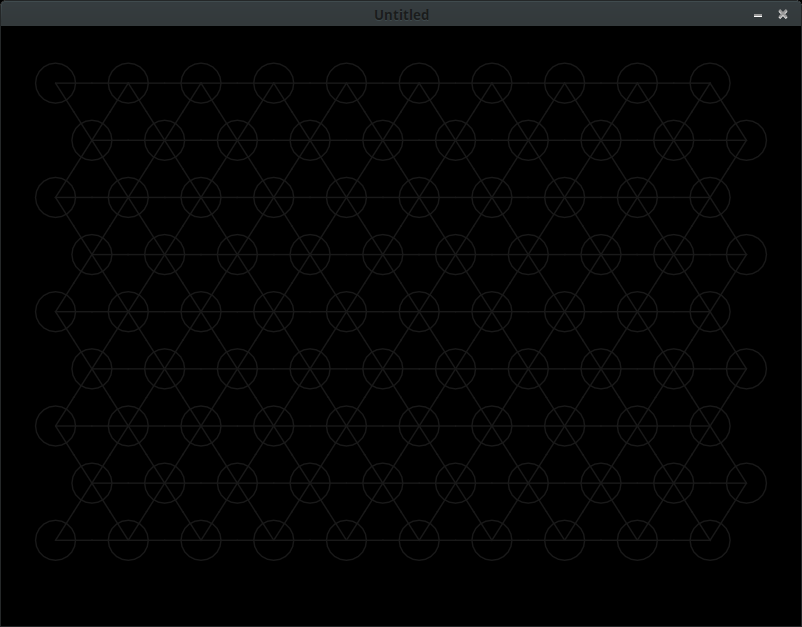
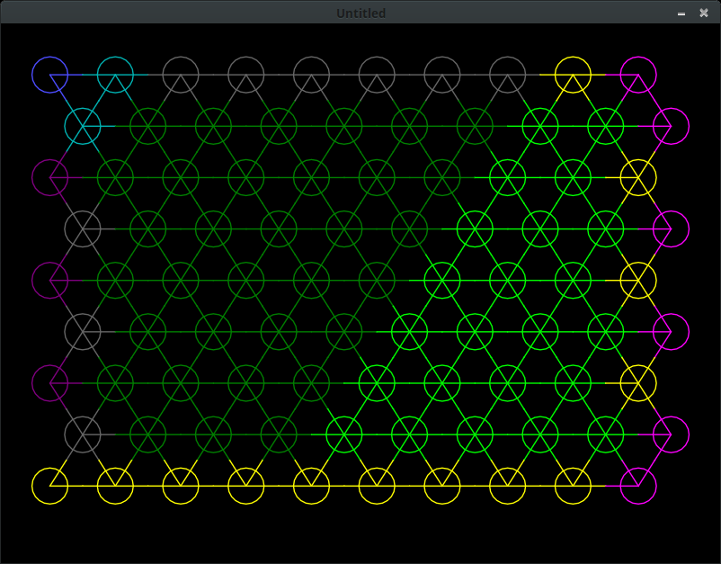
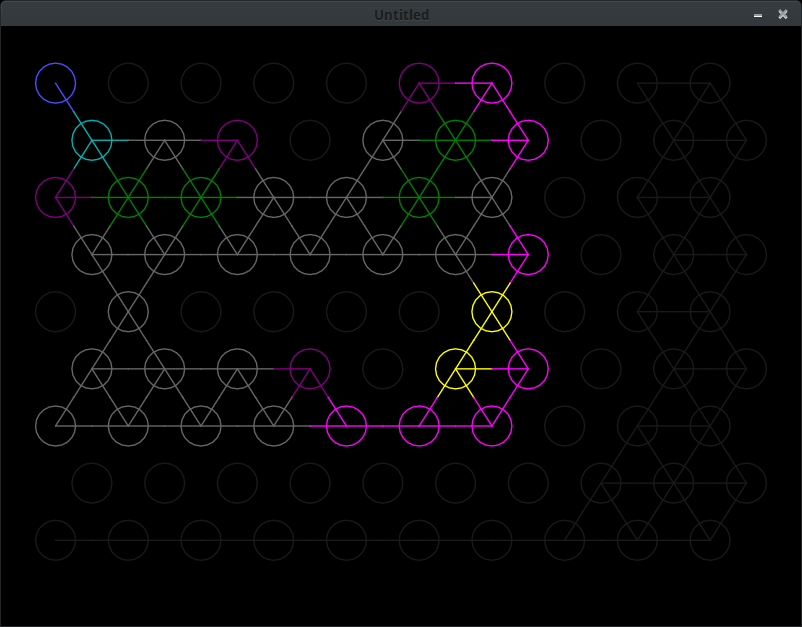
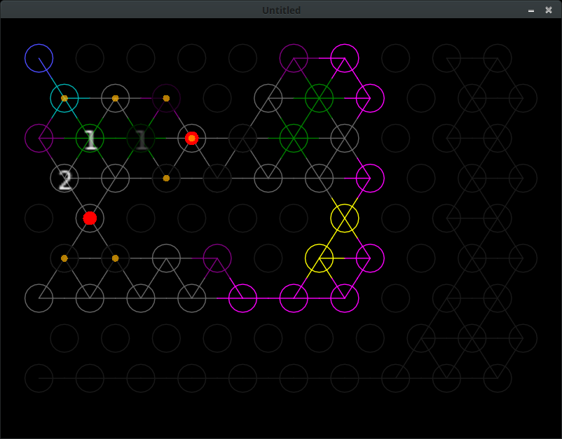
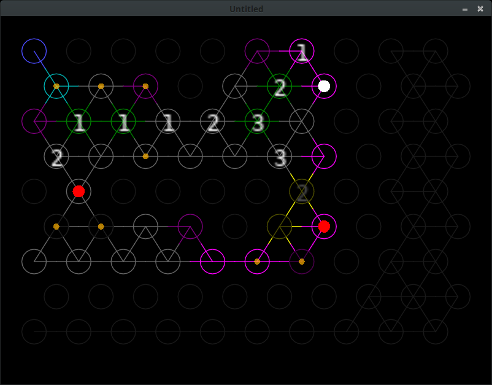
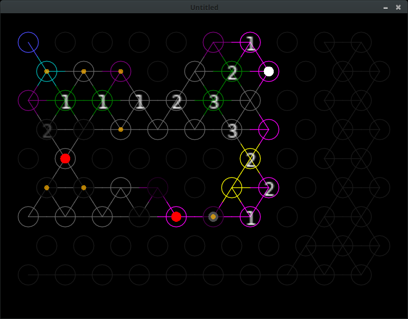

# EvEexplo

# Credit

This project is heavily based on the **DutchDefender**'s results: [Before 8 it's bait](https://youtu.be/SeEW0_3ksX0)

All programing done by myself, you can found me flying as [Nazzira Nonest](https://zkillboard.com/character/2115272085/)

Feel free to contribute to this project, to give feedback, or donate ISK!

# Roadmap

- AI to find the optimal route to the Core
- Better control in all platforms
- Better design

# Init



# Set spawn point



First click: spawn point

- Bright: High chance to core spawn
- Dark: No chance to core spawn
- Green: Safe zone, no chance to spawn defensive subsystem
- Yellow/Grey: Normal zone
- Purple: High chance to spawn data cache

# Set walls



Click: change Node type

normal -> wall -> numbers -> data cache -> defensive subsystem -> normal

# Play the game



- Yellow circle: Possible position of the utility subsystems, data cache or core
- Red circle: defensive subsystem
- Faded node: Blocked by a defensive subsystem






# Install, run

## Windows

### x64

- Download the Win64.zip
- Unzip it
- Double click on the EvExplo.exe
 
### x86

- Download the Win32.zip
- Unzip it
- Double click on the EvExplo.exe

## Android

- Download the [LÖVE for Android](https://play.google.com/store/apps/details?id=org.love2d.android) from the Play Store.
- Download the EvExplo.love file.
- Open the file from a file explorer with the *LÖVE for Android* application.

(Recommended file explorer: Cx File Explorer) #notpaidpromotion

### Alternative

- Download the [LÖVE for Android](https://play.google.com/store/apps/details?id=org.love2d.android) from the Play Store.
- Download the main.lua file from the repository
- Place it to ```/sdcard/lovegame``` folder
- Run the *LÖVE for Android* application

## Linux 

### Adding Löve PPA to your system
```bash
sudo add-apt-repository ppa:bartbes/love-stable
sudo apt-get update
```

### Install love-stable
```bash
sudo apt-get install love-stable
```

Double clik on the ```EvExplo.love``` file or
```bash
love EvExplo.love
```

(Löve version: 11.3)

## OSX, iOS

- [OSX](https://love2d.org/wiki/Game_Distribution#Creating_a_macOS_Application)
- [iOS](https://love2d.org/wiki/Game_Distribution#iOS)